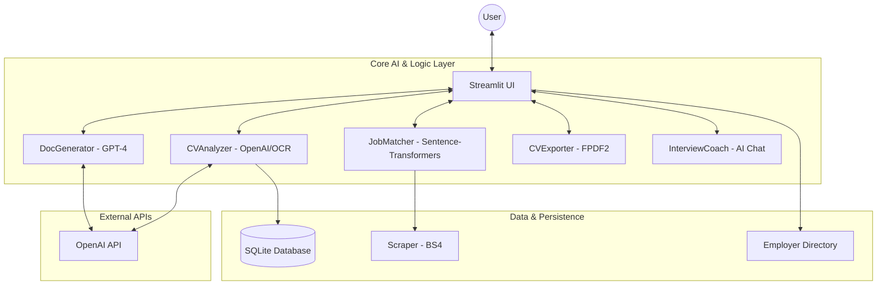

<div align="center">

# 🚀 ForsaFlow AI

*Your Intelligent Career Companion & Job Search Assistant*

[](https://www.python.org/downloads/)
[](https://streamlit.io)
[](https://openai.com/)
[](https://www.sqlite.org/)

</div>

> **ForsaFlow AI** (formerly *CareerFlow AI*) is an advanced, AI-powered career accompaniment platform. Originally developed as an academic capstone project (PFE), it provides an end-to-end toolkit to optimise the job search experience with a localised focus on the Moroccan job market.

## ✨ Key Features

*   **🧠 Intelligent CV Analysis (`CVAnalyzer`)**
    *   **Multi-Format Support:** Extracts text and data from standard PDFs, Image-based PDFs, DOCX, and standard image formats (via OCR).
    *   **Hybrid AI ATS:** Uses both heuristic business rules and **GPT-4o-mini** to provide an industry-standard ATS score and deep semantic skill extraction.
    *   **Market Localisation:** Calculates compatibility specifically tailored to the Moroccan job market (local keywords, French/Arabic/English language weighting).
*   **🎯 Semantic Job Matching (`JobMatcher`)**
    *   Goes beyond basic keyword matching! By utilising state-of-the-art NLP (`sentence-transformers`: `paraphrase-multilingual-MiniLM-L12-v2`), ForsaFlow calculates true cosine-similarity between the context of a candidate's profile and the nuances of a job description.
*   **✍️ Contextual Document Generation (`DocGenerator`)**
    *   Instantly generates highly tailored Cover Letters and professional LinkedIn outreach messages by merging a user's extracted CV metadata with the target job's requirements.
*   **🎨 Professional CV Export (`CVExporter`)**
    *   Transforms structured candidate data into a beautifully formatted, ready-to-download PDF CV aligned with modern design standards.
*   **💬 AI Interview Coach (`InterviewCoach`)**
    *   An integrated interactive chatbot designed to simulate real interview scenarios and provide constructive, real-time feedback.
*   **📊 Integrated Applicant Tracking**
    *   Built-in SQLite database allows users to track their applications, favourite job offers, and monitor their job hunt status over time.

---

## 🏗️ Technical Architecture

ForsaFlow AI relies on a clean, modular architecture separating the user interface from the underlying AI and data logic:



## 🚀 Installation & Setup

To run ForsaFlow AI locally on your machine, follow these steps:

### 1. Clone the repository
```bash
git clone https://github.com/your-username/forsaflow-ai.git
cd forsaflow-ai
```

### 2. Set up the Python Environment
Ensure you have **Python 3.9 or higher** installed. It is recommended to use a virtual environment.
```bash
python -m venv .venv
# On Windows:
.venv\Scripts\activate
# On Linux/macOS:
source .venv/bin/activate
```

### 3. Install Dependencies
```bash
pip install -r requirements.txt
```
*(Note: For OCR features to work properly, you may need to install `tesseract-ocr` on your system natively).*

### 4. Environment Variables
Create a `.env` file in the root directory based on the provided `.env.example`:
```env
OPENAI_API_KEY=your_openai_api_key_here
```

### 5. Launch the Application
Run the Streamlit server:
```bash
streamlit run app.py
```
Wait a few seconds, and the app will become available at `http://localhost:8501`.

## 📸 Screenshots

> *(Tip: Add screenshots or GIFs of your Streamlit UI here to show recruiters and developers what the app looks like!)*

*   **Dashboard View**: ``
*   **CV Analyzer in Action**: ``
*   **Mock Interview Chat**: ``

## 💻 Technologies Used

*   **Frontend:** [Streamlit](https://streamlit.io/)
*   **Backend / AI:** Python, LangChain, `sentence-transformers`, OpenAI GPT-4
*   **Data Parsing:** BeautifulSoup4 (BS4), PyPDF2, Tesseract OCR
*   **Database:** SQLite (`forsaflow.db`)
*   **Styling / Export:** FPDF2 

## 🎓 About This Project

This project was developed as a Final Year Academic Project (PFE - Projet de Fin d'Études). The primary goal was to bridge the gap between talented candidates and the specifics of the Moroccan corporate landscape using cutting-edge Generative AI and NLP tools.

## 📄 License
This project is licensed under the MIT License - see the [LICENSE](LICENSE) file for details.
